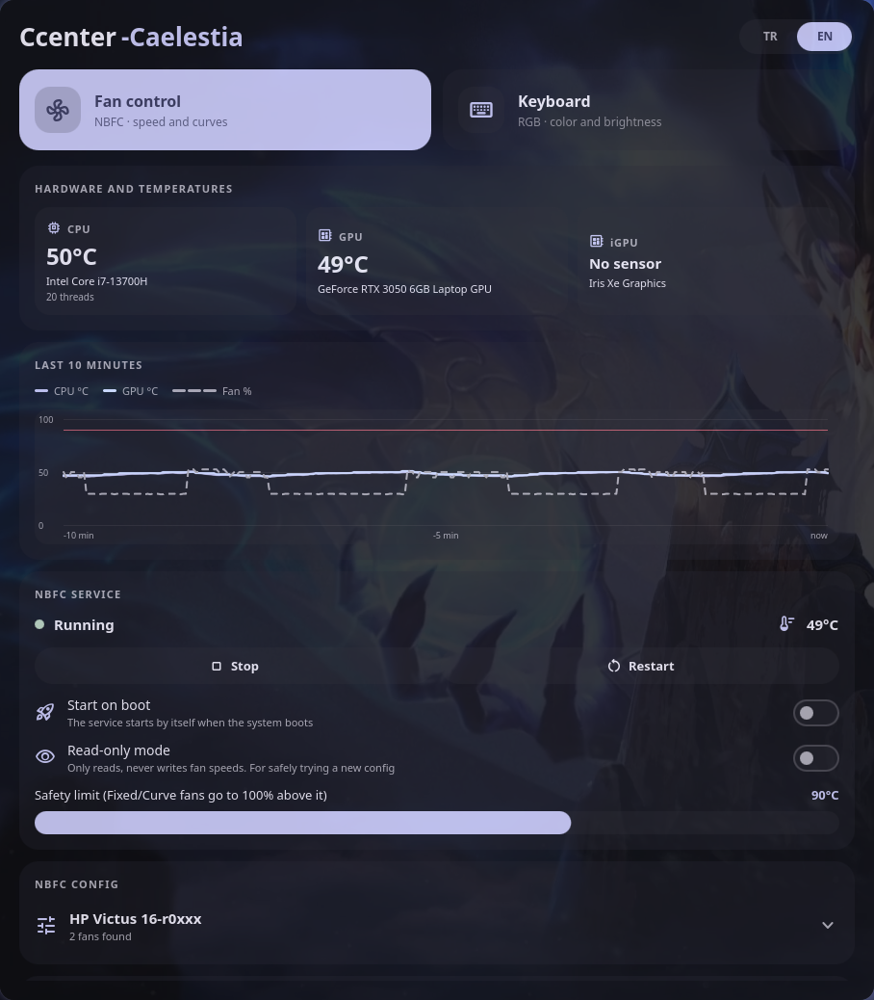
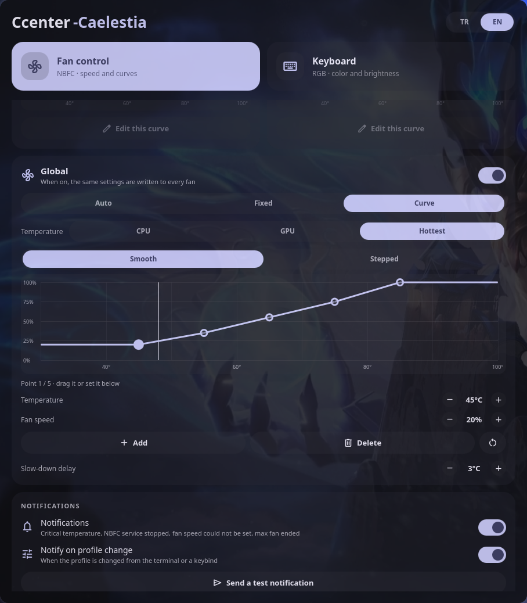
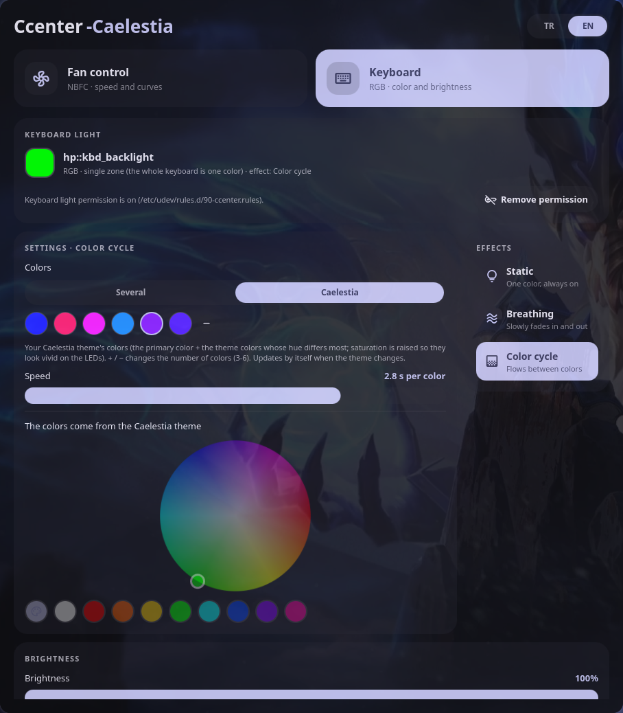
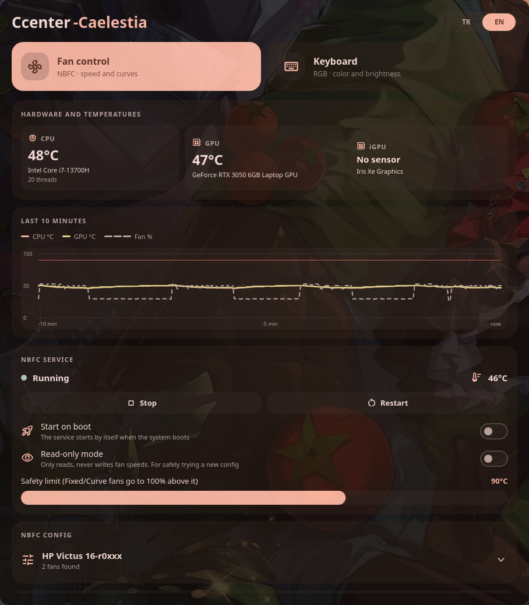
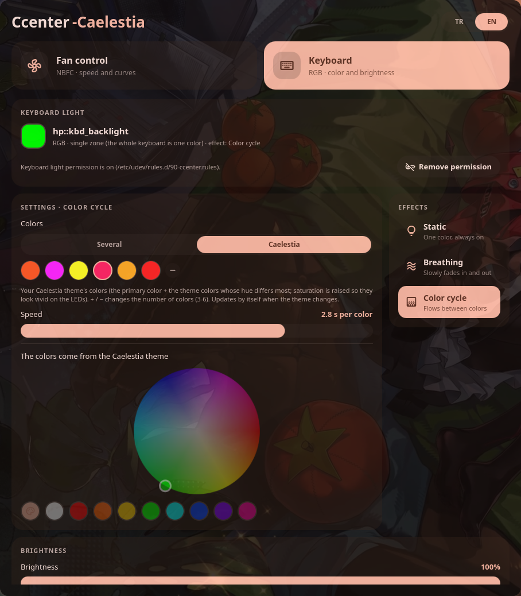

# Ccenter-Caelestia

A laptop control center for **fan control** and **keyboard lighting**, built with [Quickshell](https://quickshell.org) and themed to match [Caelestia dots](https://github.com/caelestia-dots).

> [!WARNING]
> **This project is in a very early stage. Use it at your own risk.**
>
> - **It has only been tested on one laptop: HP Victus 16-r0xxx** (i7-13700H, RTX 3050, Arch Linux, Hyprland). It has not been tried on other HP models or on laptops from other brands, and it may not work there.
>   - Fan control needs a working NBFC config for your exact model.
>   - Keyboard lighting has only been tested with the single-zone RGB backlight of HP's `hp-wmi` driver.
> - The fan section **writes fan speeds to your hardware** through NBFC. A wrong setting can make your laptop run hot. Keep an eye on temperatures.
> - In *Fixed* and *Curve* modes the app itself drives the fans. Closing the window keeps it running in the background; quitting it hands the fans back to NBFC. If the app is killed in another way, the fans **stay at the last speed it set**; run `nbfc set -a` to return them to automatic control.
> - Things will change and break without notice. The name is temporary too.

## Screenshots

| Fan control | Curve editor | Keyboard |
|---|---|---|
|  |  |  |

The colors follow your Caelestia theme. The same app with a different wallpaper:

| Fan control | Keyboard |
|---|---|
|  |  |

## Features

### Fan control (via NBFC-Linux)
- Live temperature, fan speed and service status
- Per-fan modes: **Auto**, **Fixed** (constant %), **Curve** (temperature → speed)
- Curve editor with draggable points, fine-tuning, smooth or stepped curves
- "Global" card that applies one setting to every fan
- Profiles: built-in (NBFC Auto, Quiet, Balanced, Performance) and your own saved ones
- Per-fan temperature source in Curve mode (CPU, GPU or the hotter one)
- Hysteresis and gradual slow-down in Curve mode, so fans don't keep revving up and down
- Shows your NBFC config's own fan curve and lets you copy it into an editable curve
- Max fan button (5 min, 15 min or until turned off)
- Last 10 minutes graph of CPU/GPU temperature and fan speed
- Desktop notifications through Caelestia: critical temperature, NBFC service stopped, fan speed could not be set, max fan ended, profile switched from a keybind (can be turned off)
- Real fan RPM when the driver reports it
- Tray icon in the Caelestia bar: click to show/hide, hover for profiles, max fan and quit
- Light on resources: ~0.5% CPU in the background when NBFC is in control
- Settings are saved in `~/.config/ccenter/settings.json`
- Safety limit: above 90 °C, fans in Fixed/Curve mode go to 100%
- NBFC service controls (start / stop / restart, read-only mode, start on boot) and config selection
- CPU, GPU and iGPU temperatures. A sleeping NVIDIA GPU is not woken up just to read its temperature.

### Keyboard lighting
- Change the keyboard **color** (color wheel, presets, or your Caelestia theme color) and **brightness**
- Works with the kernel's keyboard backlight interface (`/sys/class/leds/*::kbd_backlight`); single-zone RGB (the whole keyboard is one color) or brightness only on non-RGB keyboards
- **Breathing effect**: the light fades in and out with your color, cycles through up to 6 colors of your choice, or uses your Caelestia theme colors (follows theme changes). Adjustable speed and lowest/highest level; with a lowest level above 0 the light never goes dark and the colors flow into each other. Keeps running when the window is closed and resumes after a restart
- **Color cycle effect**: the light flows smoothly between your colors (or the Caelestia theme colors) without dimming
- Caelestia colors: 3 to 6 colors taken from your current theme, picked so they look different from each other
- More effects (rainbow, …) are not there yet

### Languages
- The interface is available in **English** and **Turkish**. Switch with the **TR / EN** button in the window header (or `ccenter lang en`); the change applies right away.
- By default it follows your system language (Turkish if your locale is `tr_*`, English otherwise). Your choice is saved.
- Terminal commands, notifications, the tray menu and `install.sh` / `uninstall.sh` follow the same language.
- Built-in profile names work in any language from the terminal (`quiet`, `Quiet` and `Sessiz` all apply the same profile).

### Caelestia integration
- Colors follow Caelestia's scheme (`~/.local/state/caelestia/scheme.json`) live.
- Rounding, spacing, fonts, animations and transparency come from your Caelestia shell settings, so the app looks like the rest of your shell. With Hyprland blur enabled, the window is blurred like Caelestia's panels.
- Ccenter only **reads** Caelestia files and never modifies them.

## Requirements

- [Quickshell](https://quickshell.org) (developed on 0.3.x)
- [Caelestia shell](https://github.com/caelestia-dots/shell) (`caelestia-shell`): Ccenter imports its QML plugin for design tokens, so it **will not start without it**
- [nbfc-linux](https://github.com/nbfc-linux/nbfc-linux) with a working config for your laptop
- A polkit agent (service and config actions use `pkexec`)
- [Material Symbols Rounded](https://fonts.google.com/icons) font
- `make` (for installing)
- Optional: `python-gobject` (tray icon in the Caelestia bar), `nvidia-smi` (NVIDIA GPU temperature), `lspci` (GPU names)

## Installation

```sh
git clone https://github.com/kerimozgurtukenmez/Ccenter-Caelestia.git
cd Ccenter-Caelestia
./install.sh
```

Then start **Ccenter** from your app launcher, or run `ccenter`.

**No `sudo` needed.** `install.sh` installs into your own home folder and shows the exact plan before it writes anything:

| What | Where |
|---|---|
| App, `ccenter` command and icon | `~/.local/share/ccenter/` (the command is `~/.local/share/ccenter/bin/ccenter`) |
| Launcher entry | `~/.local/share/applications/ccenter.desktop` |
| Background service (off until you enable it) | `~/.local/share/systemd/user/ccenter.service` (or `~/.config/systemd/user/`) |
| Short `ccenter` command | `~/.local/bin/ccenter`, a link to the command above |
| `ccenter` in your `PATH` (only if it isn't already, asked separately) | a small marked block in `~/.bashrc` / `~/.zshrc`, or `~/.config/fish/conf.d/ccenter.fish` |

Everything lives in the app's own folder; the other entries are only added where they can be. If a folder is not writable (for example `~/.local/bin` owned by root because something was once installed there with `sudo`), or a file with the same name belongs to another program, that entry is skipped and the installer tells you why. Nothing of yours is overwritten and you never have to change permissions.

The app writes its settings to `~/.config/ccenter/settings.json`, and only after you change something.

### Permissions: asked, never taken silently

- **Keyboard light (optional).** To change the keyboard color and brightness, Ccenter needs write access to two files of your keyboard backlight (`/sys/class/leds/*::kbd_backlight/brightness` and `multi_intensity`). `install.sh` explains what this does and **asks** you; the default answer is no. Only if you say yes, your password is asked for that single step, which adds `/etc/udev/rules.d/90-ccenter.rules`. You can also grant it later from the Keyboard tab (the "Grant permission" button; your password is asked by the system's own dialog) and remove it there again ("Remove permission"). It only affects the keyboard light; it gives no access to fans, files or the system.
- **NBFC service actions** (start/stop/restart the fan service, apply a config) ask for your password through polkit every time you use them. Setting fan speeds does not need a password.

### Uninstall

```sh
./uninstall.sh
```

It shows what it will delete (including only Ccenter's own `PATH` block in your shell startup files), quits Ccenter (keyboard back to your static color, fans back to NBFC) and asks separately whether to remove the keyboard permission and whether to keep your settings.

### Packaging / system-wide install

The `Makefile` is for packagers (`make DESTDIR=… PREFIX=/usr install`) or a system-wide install with `sudo make install`. It never adds the keyboard permission on its own; that is a separate, optional `sudo make udev`.

### Running in the background
- Closing the window does **not** quit Ccenter; it keeps controlling the fans in the background. Open it again from the launcher, the tray icon or with `ccenter`.
- To quit completely, use the "Quit" button in the app, the tray menu or `ccenter quit`. Fans that Ccenter was controlling are handed back to NBFC's automatic control first.
- "Start in background on login" in the app enables the systemd user service. Stopping the service quits Ccenter the same way as "Quit" (keyboard effect back to your static color, fans back to NBFC); if it crashes, fans are still handed back to NBFC (`nbfc set -a`).
- Only one copy of Ccenter runs at a time. `ccenter` refuses to start a second copy, because two copies would fight over the fans.

### Terminal control

```sh
ccenter                     # open the window (starts the app if needed)
ccenter status              # fans, temperatures, active profile
ccenter profiles            # list profiles (* = active)
ccenter profile quiet       # apply a profile (case-insensitive; built-ins: auto, quiet, balanced, performance)
ccenter boost 15            # max fan for 15 minutes (0 = off, -1 = until turned off)
ccenter kbd color "#ff0000" # keyboard color
ccenter kbd brightness 50   # keyboard brightness in percent (0 = off)
ccenter kbd effect cycle    # keyboard effect: static | breathing | cycle
ccenter kbd source theme    # breathing colors: single | multi | theme (Caelestia)
ccenter kbd speed 60        # effect speed 0-100
ccenter kbd range 20 80     # breathing lowest and highest level in percent
ccenter kbd themecount 5    # number of Caelestia colors (3-6)
ccenter lang en             # interface language: en | tr
ccenter hide                # also: open, toggle
ccenter quit                # quit; fans go back to NBFC auto
ccenter --help
```

Handy for Hyprland keybinds, e.g. `bind = SUPER, F9, exec, ccenter profile performance`.

The window uses the app ID `ccenter`, so you can target it in Hyprland rules with `class:^(ccenter)$`.

## Reverting changes

- Return fans to NBFC's automatic control: `nbfc set -a`
- Ccenter never edits NBFC config files. It only changes which config is selected. To go back to a config of your choice: `sudo nbfc config --set "<config name>"` followed by `sudo nbfc restart`
- Remove the app: `./uninstall.sh` (see above)

## Development

Run it straight from the cloned folder without installing:

```sh
./bin/ccenter
```

`bin/ccenter` uses the folder it lives in, so the same commands work (`./bin/ccenter status`, …). Quit the installed copy first; only one copy can run at a time. Keyboard permission works the same way (Keyboard tab > "Grant permission"). Quickshell reloads the UI live when you save a file.

### Notes for contributors and forks

- **Architecture:** the logic lives in `services/` (singletons that keep running when the window is closed); `modules/` is only the view and talks to the services. Fan settings have one source of truth, `services/FanState.qml`; the fan cards display it and report changes back. The window is created only while it is open (`LazyLoader` in `shell.qml`) to keep the background footprint small.
- **Style:** sizes, spacing, fonts and animations come from Caelestia (`Tokens.*`, `StyledText`, `Anim`/`CAnim`), colors from `services/Colours.qml`. Avoid hard-coded values so the app keeps matching the user's shell.
- **Text and translations:** write UI text in English and wrap it: `I18n.t("Fan %1").arg(n)`. Then add the Turkish line to `services/translations.js` (the key is the exact English text). Missing translations fall back to English. To add a language, add a block to `translations.js` and an entry to `I18n.languages` in `services/I18n.qml`. Shell scripts use a small `t "English" "Türkçe"` helper instead.
- **Performance:** the app runs in the background all the time. `scripts/sensors.sh` runs every few seconds, so it only uses shell built-ins; heavy bindings are skipped while the window is hidden (`Nbfc.uiVisible`).
- **Safety:** never write NBFC config files and never touch Caelestia's files (read only). Anything that changes the system must be opt-in and have a way to undo it.
- Test without clicking through the UI with the terminal commands (`./bin/ccenter status`, `profile …`, `kbd …`).

## Project layout

```
shell.qml           window, tabs, terminal commands (IPC), tray wiring
services/           always-running backends: NBFC, fan state, keyboard, settings, sensors, colors, notifications, tray
services/I18n.qml   UI language; translations in services/translations.js
modules/fan/        fan tab (UI only)
modules/keyboard/   keyboard tab
components/         shared UI components
utils/              helpers
scripts/            sensor / hardware info scripts, tray icon helper
assets/             icons and images used by the app
docs/screenshots/   README images (not installed)
bin/ccenter         launcher and terminal commands
dist/               desktop entry and systemd user service
install.sh          install into ~/.local (no sudo; asks about the keyboard permission)
uninstall.sh        remove it again
Makefile            system-wide install / packaging
LICENSE             GPL-3.0
```

## Status / roadmap

- [x] Fan control through NBFC
- [x] Persist per-fan settings across restarts
- [x] Profiles, background mode, tray icon, notifications
- [x] Installation without sudo (`./install.sh`), permissions only when you agree
- [x] Keyboard color and brightness
- [x] Keyboard breathing effect (one color, several colors or Caelestia theme colors)
- [x] Keyboard color cycle effect
- [ ] More keyboard effects (rainbow, …)
- [ ] Keep the keyboard color in sync with the Caelestia theme automatically (one-click theme color is already there)
- [x] English and Turkish UI

Issues and feedback are welcome, but expect rough edges.

## Acknowledgements

Ccenter is built on top of other people's open-source work. Many thanks to the developers of:

- **[Caelestia](https://github.com/caelestia-dots)**, the shell and dots this app is made for. Its colors, design tokens and overall look come from there.
- **[Quickshell](https://quickshell.org)**, the toolkit the whole app is built with.
- **[NBFC-Linux](https://github.com/nbfc-linux/nbfc-linux)**, which does the actual fan control, and its contributors, whose laptop configs make fan control possible on so many machines.
- **[Material Symbols](https://fonts.google.com/icons)**, the icons used throughout the app.

## License

Copyright (C) 2026 Kerim Özgür Tükenmez

Ccenter is free software: you can redistribute it and/or modify it under the terms of the **GNU General Public License version 3** as published by the Free Software Foundation. It is distributed in the hope that it will be useful, but **without any warranty**; without even the implied warranty of merchantability or fitness for a particular purpose. See [`LICENSE`](LICENSE) for the full text.

Third-party parts:

- **[Caelestia shell](https://github.com/caelestia-dots/shell)** (GPL-3.0): Ccenter imports its QML plugin at runtime, and the transparency maths in `services/Colours.qml` is adapted from Caelestia's `Colours.qml`. Caelestia is not bundled.
- **[Quickshell](https://quickshell.org)** (LGPL-3.0), **[nbfc-linux](https://github.com/nbfc-linux/nbfc-linux)** (GPL-3.0) and the **[Material Symbols](https://fonts.google.com/icons)** font (Apache-2.0) are used as separate programs or system fonts; they are not included in this repository.

Ccenter is made for Caelestia users, but it is an independent project: it is not made, endorsed or supported by the Caelestia, Quickshell or NBFC developers, or by any laptop vendor. Please report problems with Ccenter here, not to them.
